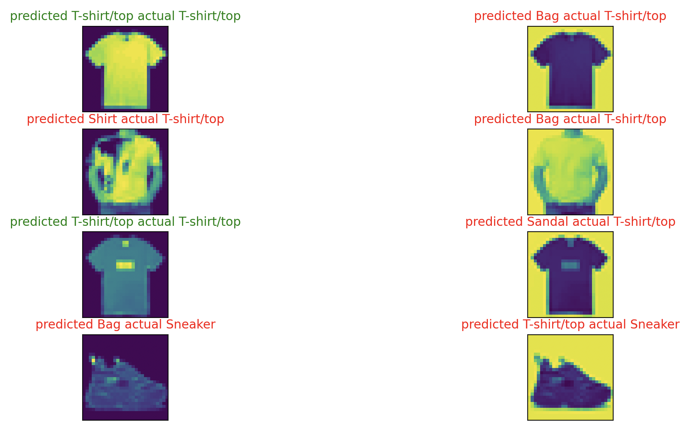

# Pytorch Quickstart tutorial

A run through of PyTorch's [Quickstart Tutorial](https://pytorch.org/tutorials/beginner/transfer_learning_tutorial.html)
which builds a simple computer vision model off of a standardized dataset
of images of different types of clothing/apparel/accessories.

Also demonstrates one of the model's weaknesses, namely that it performs
poorly on images without black backgrounds, since the entire training data
set is full of images with black backgrounds. I noticed this when I tried
the model on a few images I screen-shotted off the internet that all had
while backgrounds and the model failed on all of them in spite reaching
over 80% accuracy during training.

I edited the backgrounds of the images off the internet to be black, and
I demonstrate that the model starts to guess more accurately once I've done
that.

I plot the images off the internet both with and without black backgrounds
and compare the model's label to their actual label.

## TL;DR; quick setup
Note: tested with python 3.11.2 on MacOS

Pre-requisites (assuming you have absolutely nothing installed):

1. Homebrew:
* A 64-bit Intel CPU or Apple Silicon CPU 1
* macOS Monterey (12) (or higher) 2
* Command Line Tools (CLT) for Xcode (from `xcode-select --install` or https://developer.apple.com/download/all/) or Xcode 3

2. Setup a python 3 environment
```
# if you don't already have pyenv installed
brew install pyenv

pyenv install 3.11.2
pyenv version 3.11.2
pyenv shell 3.11.2
```

3. Install the dependency libraries
 
```
pip3 install -r requirements.txt
```

## Run the thing!

1. Run it, it will train the model from scratch. Stop it with CTRL-C after
you're satisfied with the accuracy, or get bored, or it hits 54 epochs.
```
python quickstart.py
```

2. After the model is trained, edit quickstart.py and set `TRAIN` to `False`
and run it again!

```
python quickstart.py
```

You'll see on the left column, images I got from the internet that I
modified in [GIMP](https://www.gimp.org/) to have black backgrounds.
The originals on the right column, had white backgrounds originally (they 
show up with yellow). Each image is labeled with the model's "predicted"
and the "actual" correct label. You can see that the model is basically
incapable of recognizing images with white backgrounds 😂.



```
python quickstart.py
Shape of X [N, C, H, W]: torch.Size([64, 1, 28, 28])
Shape of y: torch.Size([64]) torch.int64
Using cpu device
NeuralNetwork(
  (flatten): Flatten(start_dim=1, end_dim=-1)
  (linear_relu_stack): Sequential(
    (0): Linear(in_features=784, out_features=512, bias=True)
    (1): ReLU()
    (2): Linear(in_features=512, out_features=512, bias=True)
    (3): ReLU()
    (4): Linear(in_features=512, out_features=10, bias=True)
  )
)
testing the model against test_data set:
predictions = 10000 correct_predictions = 8034
accuracy = 80.34%
Predicted: "0", Actual: "0"
Predicted: "8", Actual: "0"
Predicted: "6", Actual: "0"
Predicted: "8", Actual: "0"
Predicted: "0", Actual: "0"
Predicted: "5", Actual: "0"
Predicted: "8", Actual: "7"
Predicted: "0", Actual: "7"
```
# Quick links to the tutorial and it's parts, plus other interesting/useful docs

# basic tutorial

https://pytorch.org/tutorials/beginner/basics/intro.html

## Tensors Tutorial
https://pytorch.org/tutorials/beginner/basics/tensorqs_tutorial.html

[All tensor operations](https://pytorch.org/docs/stable/torch.html)

## Data Tutorial
https://pytorch.org/tutorials/beginner/basics/data_tutorial.html

## Transforms Tutorial
https://pytorch.org/tutorials/beginner/basics/transforms_tutorial.html

## Build the Neural Network Tutorial
https://pytorch.org/tutorials/beginner/basics/buildmodel_tutorial.html

## Automatic Differentiation with torch.autograd
https://pytorch.org/tutorials/beginner/basics/autogradqs_tutorial.html
Optional Reading: Tensor Gradients and Jacobian Products

## Optimizing Model Parameters

optimizing_model_parameters.py

https://pytorch.org/tutorials/beginner/basics/optimization_tutorial.html

* [Different kinds of Optimizers](https://pytorch.org/docs/stable/optim.html)
* Additional good reading: https://pytorch.org/docs/stable/notes/autograd.html

## Save and Load the Model
https://pytorch.org/tutorials/beginner/basics/saveloadrun_tutorial.html

save_and_load_model.py

### related tutorials:
* https://pytorch.org/tutorials/recipes/recipes/saving_and_loading_a_general_checkpoint.html
* https://pytorch.org/tutorials/recipes/recipes/module_load_state_dict_tips.html?highlight=loading%20nn%20module%20from%20checkpoint

## General notes

* [PyTorch's API](https://pytorch.org/tutorials/beginner/basics/quickstart_tutorial.html)

Dataset, DataLoader

PyTorch has datasets included:

* [Text datasets](https://pytorch.org/text/stable/datasets.html)
* [Image datasets](https://pytorch.org/vision/stable/datasets.html)
* [Audio datasets](https://pytorch.org/audio/stable/datasets.html)

# Tensors

* A tensor of order zero (zeroth-order tensor) is a scalar (simple number).
* A tensor is a container which can house data in N dimensions. Often and erroneously used interchangeably with the matrix (which is specifically a 2-dimensional tensor), tensors are generalizations of matrices to N-dimensional space.

### Helpful videos

* [Backpropagation calculus | Chapter 4, Deep learning
](https://www.youtube.com/watch?v=tIeHLnjs5U8)